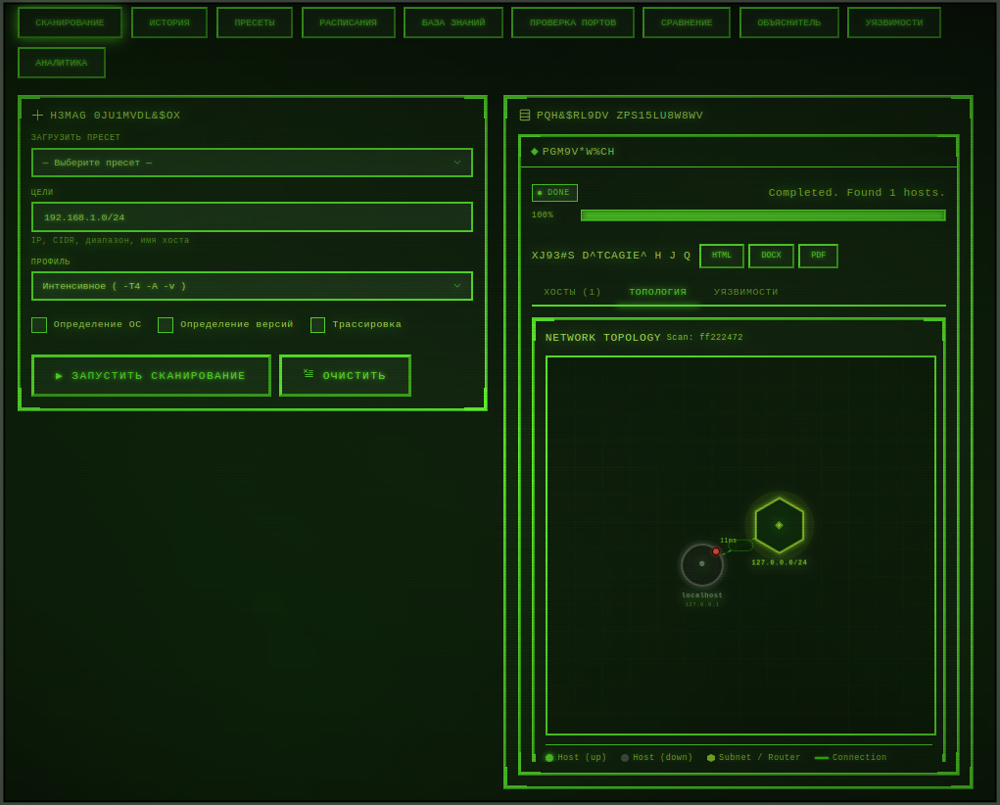
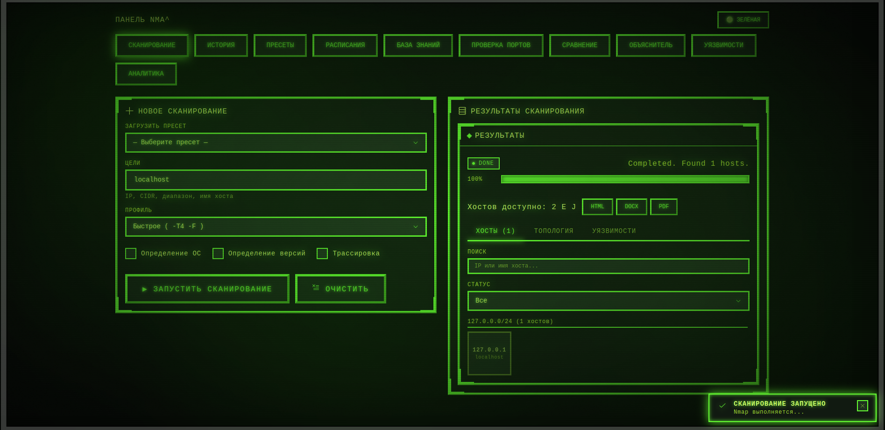
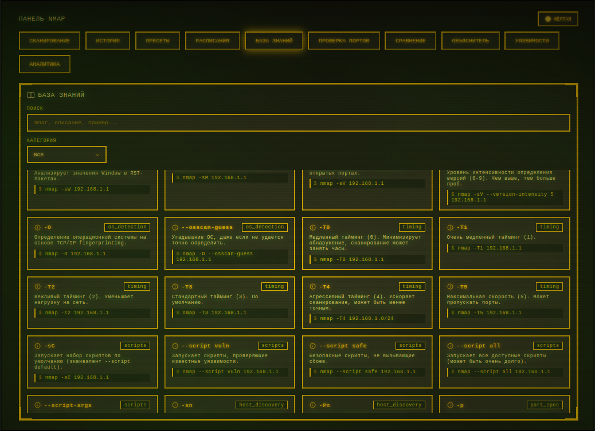

# Nmap Panel

> Версия 2.0 · 2026-09-07



**Nmap Panel** — веб-панель, которая превращает разовый скан Nmap в полноценный аудит: от обнаружения хостов и портов до запуска сторонних инструментов пентеста прямо по найденной цели. Весь рабочий процесс — в браузере, без командной строки, в неоновом «CRT»-интерфейсе.

## Чем отличается

- **Это не просто GUI для Nmap.** От результатов скана можно сразу перейти к аудиту: встроенный **терминал** (~130 разрешённых инструментов), визуальный **конструктор команд** с расписанными флагами (24 инструмента, включая `sqlmap`), и панель **«Аудит»**, которая сама запускает whatweb / nikto / nuclei / gobuster / ffuf / subfinder / httpx / sslscan / dalfox / wpscan и разбирает вывод в список находок с уровнями критичности.
- **Всё крутится вокруг скана.** Любая запись истории открывается как страница с вкладками: *сводка, хосты, топология, уязвимости, аудит, терминал*. Цель подставляется автоматически.
- **Интерактивная топология сети** на D3 (по traceroute или по подсетям `/24`) плюс режимы «сетка / дерево / таблица».
- **Обучающий слой:** встроенная база знаний по флагам Nmap и «Объяснитель», который разбирает любую строку `nmap …` на флаги с описанием.
- **Сравнение сканов** — наглядный diff: какие хосты и порты появились, пропали, изменились.
- **Автоизвлечение CVE** из NSE-скриптов, дашборд аналитики, отчёты HTML / DOCX / PDF, планировщик по cron.
- **Docker с самонастройкой инструментов:** образ бэкенда сам ставит десятки утилит (профиль `slim` — быстро, только apt; `full` — плюс Go / pipx / testssl).

---

## Быстрый старт

### Docker (рекомендуется)

```bash
docker compose up --build        # первый запуск: соберёт бэкенд и подтянет инструменты
docker compose up                # последующие запуски
```

Собранная панель (`nmap-panel/dist/`) лежит в репозитории, её отдаёт стоковый
`nginx:alpine`. **Node.js на хосте не нужен**, при запуске нет обращений к npm —
работает одинаково на Linux, macOS и Windows.

- Интерфейс — **http://localhost** (порт меняется через `WEB_PORT`, напр. `WEB_PORT=8080 docker compose up`)
- API и Swagger — **http://localhost/docs** (и напрямую **http://localhost:5000/docs**)

Браузер всегда обращается к API по относительному `/api` на том же адресе, что
и панель, — nginx проксирует его на бэкенд. Никакие хосты/порты в бандл не
вшиваются, поэтому панель одинаково открывается по `localhost`, по IP машины
или из другой ВМ.

Изменили фронтенд? Пересоберите панель одним из способов:

```bash
cd nmap-panel && pnpm install && pnpm build          # нужен Node.js 18+ на хосте
# или собрать внутри Docker (нужен доступ к npm при сборке):
docker compose -f docker-compose.yml -f docker-compose.build.yml up --build
```

Профиль набора инструментов:

```bash
TOOLS_PROFILE=slim docker compose up --build   # быстрая сборка, только пакеты apt
TOOLS_PROFILE=full docker compose up --build   # (по умолчанию) + nuclei, subfinder, httpx, dalfox, ffuf, testssl…
```

Недостающие инструменты не ломают сборку — в интерфейсе они помечаются как «нет» с подсказкой по установке.

### Локально (для разработки)

Нужны: Python 3.10+, Node.js 18+, установленный `nmap` в `PATH`.

**Быстрый способ (Windows):** `run_dev.bat` в корне — сам соберёт фронт, создаст
venv и поднимет бэкенд. Открыть **http://localhost:5000** (панель и API на одном адресе).

**Вручную, с hot-reload фронта:**

```bash
# бэкенд
cd backend
python -m venv venv && source venv/bin/activate     # Windows: venv\Scripts\activate
pip install -r requirements.txt
uvicorn app.main:app --reload --port 5000

# фронтенд (во втором терминале)
cd nmap-panel
pnpm install
pnpm dev
```

Откройте **http://localhost:5173**. Vite сам проксирует `/api` на бэкенд `:5000`
(адрес меняется через `VITE_API_PROXY`, см. `nmap-panel/.env.example`), поэтому
CORS настраивать не нужно. Бэкенд должен быть запущен.

> Если фронт и бэкенд должны жить на разных адресах (напр. бэкенд на другой
> машине), задайте абсолютный `VITE_API_BASE` при сборке — см. `nmap-panel/.env.example`.

---

## Как пользоваться



### Основной сценарий

1. **Сканирование** → задайте цели и профиль → «Запустить сканирование».
2. Следите за прогрессом справа; по завершении появится сетка хостов.
3. Скан автоматически попадает в **Историю**.
4. Откройте его из истории — откроется страница скана с вкладками. Дальше вся работа там: топология, уязвимости, аудит и команды в терминале по найденным хостам.

### Цели и профили (вкладка «Сканирование»)

**Форматы целей** (можно несколько через запятую):

| Пример | Что это |
|---|---|
| `192.168.1.1` | один адрес |
| `192.168.1.0/24` | подсеть CIDR |
| `192.168.1.1-254` | диапазон |
| `example.com` | домен |
| `10.0.0.0/16, example.com` | список целей |

**Профили:**

| Профиль | Флаги | Когда |
|---|---|---|
| Intense | `-T4 -A -v` | полный скан: ОС, версии, скрипты, traceroute |
| Quick | `-T4 -F` | быстро, 100 популярных портов |
| Ping Sweep | `-sn` | только «кто живой», без портов |
| Custom | — | свои NSE-скрипты в поле «Скрипты» |

Дополнительно — чекбоксы: определение ОС (`-O`), версий (`-sV`), трассировка (`--traceroute`). Кнопка «Отменить сканирование» останавливает активный скан.

### Страница скана (открывается из истории)

Вкладки:

- **Сводка** — параметры и итог запуска.
- **Хосты** — плитки по подсетям `/24` (зелёная рамка — up, серая — down, число — открытых портов). Поиск по IP / hostname, фильтр по статусу. Клик по хосту — модалка с портами, сервисами и версиями.
- **Топология** — граф сети:
  - *Граф* — силовая диаграмма D3: узлы-хосты и узлы-подсети, перетаскивание, зум, анимированные связи, клик по хосту → детали портов.
  - *Сетка / Дерево / Таблица* — те же данные в других представлениях; в таблице — сортировка по любому столбцу.
- **Уязвимости** — CVE, извлечённые из NSE-скриптов категории `vuln`: таблица (CVE со ссылкой на NVD, CVSS с цветовой индикацией, хост, порт), поиск, фильтр по уровню CVSS.
- **Аудит** — запуск сторонних инструментов по хосту скана (ниже).
- **Терминал** — встроенная консоль с целью из скана (ниже).

### Вкладка «Аудит»

Инструментарий дальнейшего аудита прямо по найденной цели. Инструменты сгруппированы: *веб-разведка, директории, уязвимости веб, TLS/SSL, OSINT / поддомены, сеть*.

1. Выберите цель — из списка хостов скана или впишите свою (host либо URL).
2. Нажмите «Запустить» на карточке инструмента. У некоторых есть параметры: порт, число потоков, критичность, что перечислять.
3. Задача появляется в блоке «Задачи аудита»: живой статус, а по завершении — таблица находок с уровнями `info … critical` и сырой вывод.

Инструменты: whatweb, wafw00f, HTTP-заголовки, gobuster, ffuf, feroxbuster, nikto, nuclei, dalfox, wpscan, sslscan, testssl, tlsx, subfinder, assetfinder, theHarvester, dnsx, dnsrecon, httpx. Отсутствующие в системе помечены «нет».

Задачи привязаны к скану и сохраняются — при повторном открытии страницы они на месте.

### Вкладка «Терминал» (и отдельный пункт меню)

Разовое выполнение инструментов **без сохранения в БД**. Два режима — переключатель сверху:

**Терминал** — обычная консоль:

- Вводите команду (`nmap -sV example.com`), Enter — запуск. `↑` / `↓` — история команд. `Ctrl+C` — прерывание.
- Кнопки SIGINT / KILL / Очистить, живой вывод, коды выхода.
- Чипы быстрого старта подставляют команду с текущей целью.

**Конструктор** — сборка команды визуально:

1. Выберите инструмент (карточки: sqlmap, nmap, nikto, gobuster, ffuf, whatweb, nuclei, sslscan, dig, curl, wpscan, subfinder, httpx, dnsx, dnsrecon, feroxbuster, dalfox, amass, theHarvester, masscan, hydra, sslyze, smbmap, wafw00f).
2. Укажите цель и отметьте нужные флаги — они сгруппированы («Обнаружение», «Извлечение», «Обход» …). У текстовых и числовых флагов есть поле значения, у списков — выбор.
3. Внизу — живое превью итоговой команды. «Выполнить» или «В терминал» — запуск в той же консоли. Можно взять готовый «пример».

**Безопасность:** команды разбираются без командной оболочки (никаких конвейеров, подстановок и перенаправлений), первый токен обязан входить в список разрешённых (~130 инструментов разведки / пентеста / анализа), запуск идёт в песочнице с лимитом вывода и таймаутом.

### Остальные разделы



- **Пресеты** — сохранённые конфигурации скана (имя, цели, профиль, опции, описание). «Выбрать» переносит параметры в форму сканирования. Любой скан из истории можно «скопировать» в пресет.
- **Расписания** — автозапуск сканов по cron-выражению `мин час день месяц день_недели` (`0 3 * * *` — каждый день в 03:00; `*/15 * * * *` — каждые 15 минут). Тумблер «Active» включает / выключает без удаления, «Запустить» — прямо сейчас.
- **База знаний** — справочник по флагам Nmap: поиск по флагу / названию / описанию, фильтр по категории, карточки с примером использования.
- **Объяснитель** — вставьте строку `nmap -sS -sV -p 22,80 …` и получите разбор каждого флага (категория, назначение, пример). Неизвестные флаги подсвечиваются.
- **Проверка портов** — быстрый TCP-чек без Nmap: хост + список портов (`80,443,22-25`), быстрые кнопки типовых сервисов, таблица `open / closed / error`.
- **Сравнение** — выберите два скана из истории → diff: добавленные / удалённые / изменённые хосты и порты.
- **Аналитика** — сводные карточки и графики по всем сканам: хосты и порты во времени, распределение ОС, топ сервисов и портов.
- **Отчёты** — кнопки HTML / DOCX / PDF на панели результатов скана и в каждой строке истории; содержат параметры скана, хосты и таблицы портов.

Кнопка смены темы (зелёная / жёлтая) — в правом верхнем углу.

---

## Если что-то не работает

| Симптом | Что делать |
|---|---|
| `[Errno 2] … 'nmap'` при старте скана | Nmap не в `PATH`. Проверьте `nmap --version`; в Docker он уже установлен. |
| Скан завершился, но хостов нет | Nmap мог выдать неполный XML (прерывание). Перезапустите скан. |
| Не качаются DOCX / PDF | Нет `python-docx` / `reportlab` → `pip install python-docx reportlab` (в Docker уже есть). |
| Расписания не срабатывают | Перезапустите бэкенд, проверьте системное время; APScheduler капризничает с `--reload`. |
| Инструмент в терминале / аудите — «нет» | Его нет в образе. Пересоберите с `TOOLS_PROFILE=full` или доустановите вручную по подсказке на карточке. |
| Панель открывается, но все запросы к API падают (`ERR_CONNECTION_REFUSED`, `Network Error`) | Старый бандл с вшитым `http://localhost:5000`. Пересоберите фронт (`pnpm build` или `docker compose up --build`) — теперь фронт ходит на относительный `/api`. |
| На Windows через Docker панель пустая / нет данных | Проверьте, что папка `nmap-panel/dist/` есть в репозитории и порт 80 свободен (иначе `WEB_PORT=8080 docker compose up`). |
| `pnpm install --frozen-lockfile ... did not complete` при `--build` | Сеть режет доступ к npm-реестру во время сборки. Используйте обычный `docker compose up` (готовый `dist` из репо) либо соберите панель на хосте: `cd nmap-panel && pnpm build`. |
| `pnpm dev`: запросы к `/api` → 404 | Не запущен бэкенд на `:5000`, либо задайте `VITE_API_PROXY` на его адрес. |
| Ошибки CORS | Не должно возникать: фронт и API на одном origin (nginx/vite проксируют `/api`). Если задан абсолютный `VITE_API_BASE` — пропишите этот origin в `allow_origins` в `backend/app/main.py`. |
